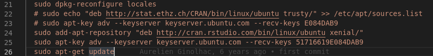

## Change Shiny server version

From

```
wget https://s3.amazonaws.com/rstudio-shiny-server-os-build/ubuntu-12.04/x86_64/VERSION -O "version.txt"

wget "https://s3.amazonaws.com/rstudio-shiny-server-os-build/ubuntu-12.04/x86_64/shiny-server-$VERSION-amd64.deb" -O ss-latest.deb  
```

to

```
wget https://s3.amazonaws.com/rstudio-shiny-server-os-build/ubuntu-14.04/x86_64/VERSION -O "version.txt"


wget "https://s3.amazonaws.com/rstudio-shiny-server-os-build/ubuntu-14.04/x86_64/shiny-server-$VERSION-amd64.deb" -O ss-latest.deb  
```


## R packages that showed errors in dependencies

*   Cairo
*   RMySQL
*   RPostgreSQL

```
sudo Rscript -e "install.packages('Cairo', repos = 'http://cran.rstudio.com/', dep = TRUE)"
sudo Rscript -e "install.packages('RMySQL', repos = 'http://cran.rstudio.com/', dep = TRUE)"
sudo Rscript -e "install.packages('RPostgreSQL', repos = 'http://cran.rstudio.com/', dep = TRUE)"
```


## libssl1.0.0.deb may not be necessary in `xenial64`

```
sudo wget -O libssl1.0.0.deb http://ftp.debian.org/debian/pool/main/o/openssl/libssl1.0.0_1.0.1t-1+deb8u8_amd64.deb
yes|sudo dpkg -i libssl1.0.0.deb
```


## trusty64 to xenial64

```
sudo echo "deb http://stat.ethz.ch/CRAN/bin/linux/ubuntu xenial/" >> /etc/apt/sources.list
```

```
sudo add-apt-repository "deb http://cran.rstudio.com/bin/linux/ubuntu xenial/"
sudo apt-key adv --keyserver keyserver.ubuntu.com --recv-keys 51716619E084DAB9
```


## Errors

```

default: ERROR: dependencies ‘curl’, ‘openssl’ are not available for package ‘httr’

    default: -----------------------------[ ANTICONF ]-----------------------------
    default: Configure could not find suitable mysql/mariadb client library. Try installing:
    default:  * deb: libmariadbclient-dev | libmariadb-client-lgpl-dev (Debian, Ubuntu)
    default:  * rpm: mariadb-connector-c-devel | mariadb-devel | mysql-devel (Fedora, CentOS, RHEL)
    default:  * csw: mysql56_dev (Solaris)
    default:  * brew: mariadb-connector-c (OSX)
    
    
    

    default: ERROR: compilation failed for package ‘RPostgreSQL’
    default: * removing ‘/usr/local/lib/R/site-library/RPostgreSQL’
    default: ERROR: dependency ‘httr’ is not available for package ‘covr’
```


* Change key for trusty64 to 51716619E084DAB9
* Change command from
    ```
    sudo echo "deb http://stat.ethz.ch/CRAN/bin/linux/ubuntu trusty/" >> /etc/apt/sources.list
    ```
    to
    ```
    sudo add-apt-repository "deb http://cran.rstudio.com/bin/linux/ubuntu trusty/"
    ```


### Shiny server start but with error after changing OS to xenial64


### Change OS from trusty to xenial





